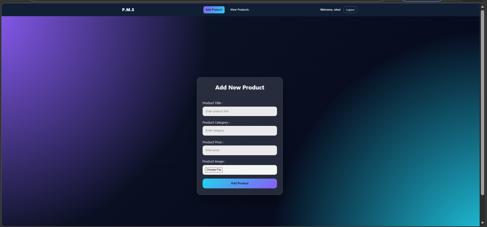
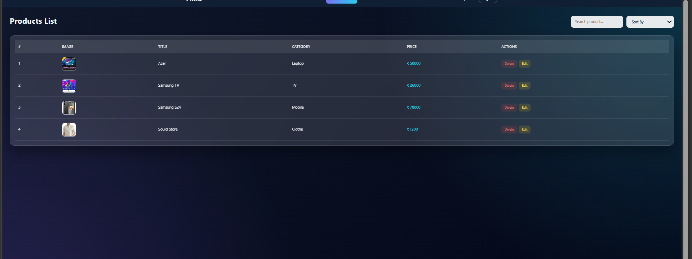

# React Practical Exam

## Overview

A small React + Vite application demonstrating a simple product management flow with signup/login, add product, and view products. The app uses Redux Toolkit for state, a lightweight API client in `src/api/apiInstance.js`, and `db.json` for a local JSON server backend.

## Features

- Signup and Login
- Add new products
- View product list
- Redux Toolkit for state management (`src/features/productSlice.js`)
- Local JSON server using `db.json` for API mocking

## Prerequisites

- Node.js 16+ (or compatible LTS)
- npm (or yarn)

## Install

1. Install dependencies:

```bash
npm install
```

2. (Optional) Start a local JSON server to serve `db.json` for the API:

```bash
npx json-server --watch db.json --port 3000
```

The app expects an API like `http://localhost:3000/products`.

## Run (development)

Start the Vite dev server:

```bash
npm run dev
```

Open the app in your browser at the address Vite prints (usually http://localhost:5173).

## Build & Preview

```bash
npm run build
npm run preview
```

## Project Structure (important files)

- [src/App.jsx](src/App.jsx)
- [src/main.jsx](src/main.jsx)
- [src/api/apiInstance.js](src/api/apiInstance.js)
- [src/app/store.js](src/app/store.js)
- [src/features/productSlice.js](src/features/productSlice.js)
- [src/components/Addproduct.jsx](src/components/Addproduct.jsx)
- [src/components/Viewproduct.jsx](src/components/Viewproduct.jsx)
- db.json (local API data)

## Notes

- If you run the JSON server on a different port, update the base URL in `src/api/apiInstance.js`.
- This repository is intended as an exam/demo project; authentication is a simplified flow for demonstration only.

Enjoy exploring the project!

## output 
   